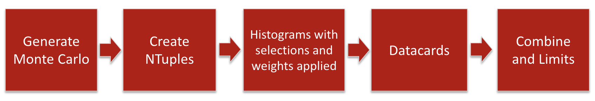

Introduction
-------------

Welcome to the mono-Z long excercise for CMSDAS. This site will guide you through the exercise and give you examples on how to use the code. 

Facilitators (LPC 2025)
~~~~~~~~~~~~

1. Daniel Fernando Guerrero Ibarra
2. Nick Manganelli
3. Rafey Hashmi
4. Richa Sharma
5. Tetiana Mazurets
6. Matteo Cremonosi

   Facilitators (CERN 2024)
~~~~~~~~~~~~

1. Yacine Haddad
2. Chad Freer
3. Nick Manganelli
4. Rafey Hashmi

Long Exercise
~~~~~~~~~~~~~

The outline of the analysis is explained in a set of slides. The general workflow of the mono-Z analysis is shown below. Due to time constraints, we will focus on the last 3 steps as explained in the exercise section of this guide. 

What you will do
~~~~~~~~~~~~~~~~

